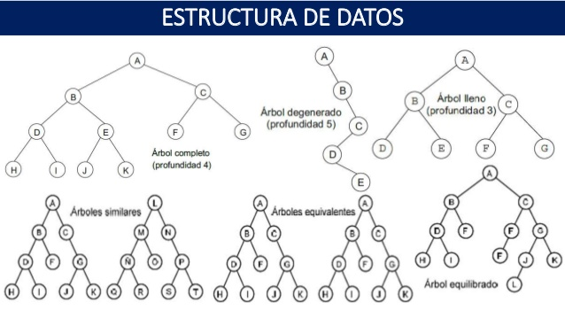
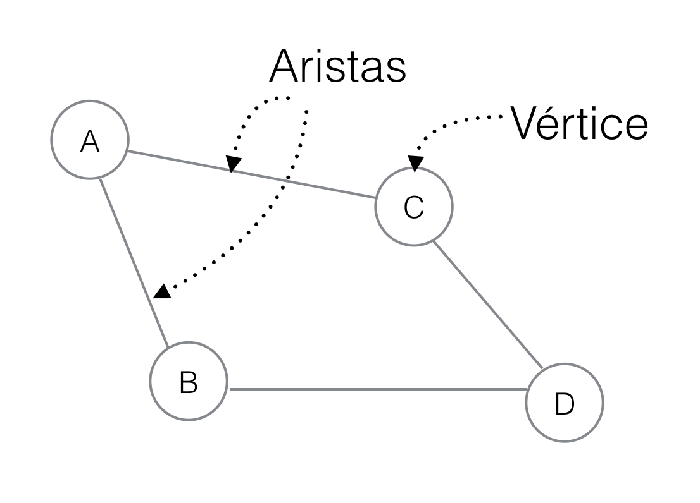
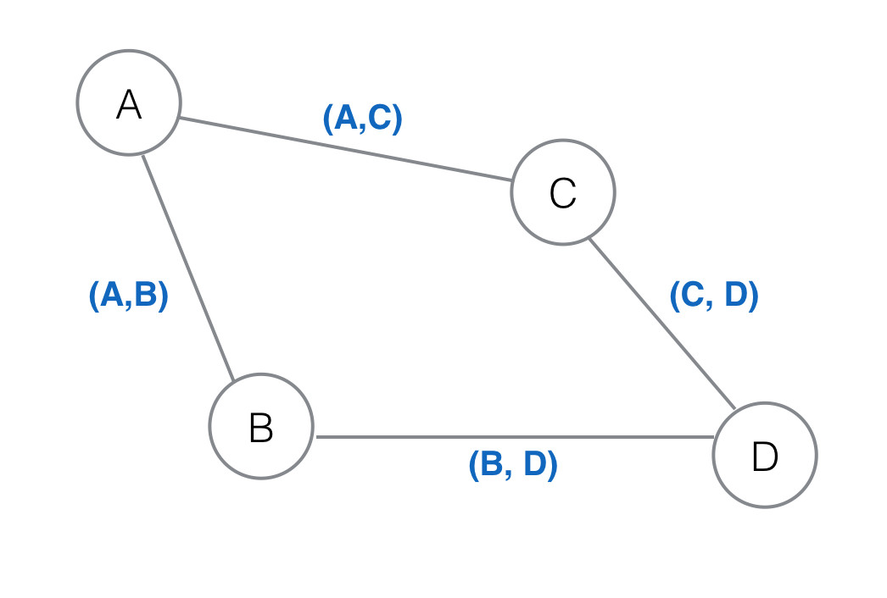

# Estructuras de datos en JavaScript

## Pila

### Teoría

Las pilas o "stacks" son una estructura de datos donde tenemos una coleccion de elementos y solo podemos hacer dos cosas:

1.-Añadir un elemento al final de la pila.
2.-Sacar el ultimo elemento de la pila.

Una manera comun de visualizar una pila es imaginando una torre de hotcakes, donde una vez que ponemos un hotcake encima de otro, no podemos sacar el anterior hasta que se haya sacado todos los que estan encima.

A pesdar de su simplicidad, las pilas son estructuras comunes en ciertas areas de la computacion, en especial para implementar o simular evaluacion de expresiones, recursión,scope,etc..

Las pilas son estructuras de tipo "LIFO" (Last in First Out), lo cual quiere decir que el ultimo elemento añadido es siempre el primero en salir.

### Código

```javascript
class Stack {

    constructor()
    {
        this.item = [];
        this.top = 0;
    }
 
    add(element)
    {
        this.item.push(element)[this.top ++];
    }

    estract()
    {
        this.item.pop();
    }
    
    getTopElement()
    {
        return this.item[this.top-1];
    }
    
    size()
    {
        return this.item.length;
    }
    
    clear()
    {
      return this.item[this.top === 0]
    }
    
    
}

var frutero = new Stack();

frutero.add("banana");
frutero.add("mango");
frutero.add("manzana");
frutero.add("pera");
frutero.add("guayaba");

document.write(frutero.size());

document.write(frutero.getTopElement());


```
## Cola

### Teoría

Se caracteriza por ser una secuencia de elementos en la que la operación de inserción push se realiza por un extremo y la operación de extracción shift por el otro. También se le llama estructura FIFO ( First In First Out), Esto es el ultimo elemento en entrar es el primero en salir

Las colas se utilizan en sistemas informáticos, transportes y operaciones de investigación, etc. , donde los elementos son tomados como datos que se almacenan y se guardan mediante colas para su posterior procesamiento.

Este tipo de estructura de datos abstracta se implementa en lenguajes orientados a objetos mediante clases, en forma de listas enlazadas.

### Código
```javascript
    // Clase cola
class Cola
{
    // el arreglo se usa para implementar la cola
    constructor()
    {
        this.items = [];
    }

// Funcion añadir
añadir(element)
{    
    // Añadir elemento a la cola
    this.items.push(element);
}
//funcion eliminar
eliminar()
{
    // remueve elemnto de la cola
    // si la cola esta vacia retorna sobreflujo

    if(this.estavacio())
        return "Sobreflujo";
    return this.items.shift();
}
// funcion frente
frente()
{
    //muestra el elemento que se encuentra al inicio sin removerlo

    if(this.estavacio())
        return "Sin elementos en la cola";
        //el indice 0 que es el inicial
    return this.items[0];
}
// funcion comprobar si esta vacio
estavacio()
{
    //regresa verdadero si la cola esta vacia
    return this.items.length == 0;
}
// ImprimirCola funcion
recorrerCola()
{
    var str = "";
    //recorremos la lista y mostramos los valores
    for(var i = 0; i < this.items.length; i++)
        str += this.items[i] +" ";
    return str;
}
}
// creamos un objeto de la clase Cola
var cola = new Cola();


//Si no hay nada en la cola muestra sobreflujo
console.log(cola.eliminar());

//comprobamos que la cola este vacia
console.log(cola.estavacio());

//Añadimos elementos a la Cola
//
cola.añadir(10);
cola.añadir(20);
cola.añadir(30);
cola.añadir(40);
cola.añadir(50);


// muestra 10
console.log(cola.frente());

// elimina el diez
// la cola ahora contiene [20, 30, 40, 50]
console.log(cola.eliminar());

// muestra 20
console.log(cola.frente());

// elimina 20
// la cola ahora contiene [30, 40, 50]
console.log(cola.eliminar());

// imprime los elementos de la cola
//  [30, 40, 50]
console.log(cola.recorrerCola());

```

## Lista ligada

### Teoría

### Código

## Árbol

Los árboles (trees) son una estructura de datos muy común, que se define de forma recursiva como una colección de nodos, empezando por un nodo raíz, donde cada nodo es una estructura de datos que contiene un valor, y opcionalmente una lista de referencias a otros nodos (sus hijos), con la limitación de que ninguna referencia esté duplicada, y que ninguna apunte al nodo raíz.

  ## Termimología de un arbol

   ### Nodo
El “nodo” es la estructura básica que usamos para construir un “árbol”. Todos los elementos de un árbol son nodos. A su vez, cada nodo es un sub-árbol. Los nodos se caracterizan por tener un valor, y referencias a otros nodos.

   ### Padres / Hijos
Los “hijos” de un nodo son los nodos a los cuáles éste hace referencia. Por ejemplo, en un documento HTML las etiquetas (nodos) <head> y <body> son hijos de el nodo <html>. Al mismo tiempo, diríamos que <html> es el nodo “padre” de tanto <head> como <body>.

   ### Nodo raíz
Todo árbol tiene un nodo inicial o nodo raíz, el cual va a ser el único nodo que no tenga un “padre”.

   ### Nodo hoja
Los nodos hoja son aquellos que no tienen hijos (las hojas del árbol).

   ### Nivel
En un árbol, cuando hablamos de “nivel” nos referimos a la distancia, o el número de saltos que debemos dar hasta llegar al nodo raíz. Podemos verlo también como el “nivel de anidación”.

   ### Altura o profundidad
La altura o profundidad de un árbol hace referencia al nivel máximo que vamos a encontrar.

   ### Orden o grado
El orden o grado de un árbol determina cuántos hijos puede tener un nodo. Por ejemplo, un árbol de orden 2 sería un árbol binario, donde cada nodo puede tener como máximo dos hijos. Un árbol de orden 3 o ternario permitiría que cada nodo tenga un máximo de tres hijos. Un árbol no está obligado a determinar un orden o grado.


### Tipos de arboles

   ### Árbol completo
Un árbol completo es aquel en el que todos los nodos tienen o ningún hijo o el número máximo de hijos.

   ### Árbol degenerado
Cuando un árbol contiene 1 sólo hijo por nodo. Los árboles degenerados tienen la profundidad máxima posible dado un número de elementos. Este tipo de árboles se comportan como listas.

   ### Árbol balanceado
Lo opuesto a un árbol degenerado sería un árbol balanceado, donde el árbol tiene la profundidad mínima posible dado un número de elementos.



### Código

## Grafo

### Teoría
Un grafo (o graph, en inglés) es un conjunto de vértices y un conjunto de aristas. Si lo vemos gráficamente tendremos:

Notarás que cada vértice esta nombrado en este caso. Para nuestro ejemplo los vértices son A, B, C y D. Cuando queremos definir una arista la podemos determinar como (Vértice, Vértice), que reprensenta los vértices que conecta dicha arista. Entonces las aristas del grafo anterior estarán representados cómo:

En el caso del grafo de arriba, que pongamos (A,B) o (B,A) es indiferente, ya que el orden no representa nada…aún. En este caso, en donde el orden de los vértices no define nada de información, pero si nos dice qué vértices estan conectados, llamamos un Grafo No Ordenado o solo grafo. Hay otros grafos que nos dará más información.

### Código
```javascript
class Grafo {

	constructor(){

		  this.nodo1 = [2,4];

	    this.nodo2 = [3,4,1];

	    this.nodo3 = [2,4];

	    this.nodo4 = [1,2,3];

	    this.nodos = [this.nodo1, this.nodo2, this.nodo3, this.nodo4];

	}

	getNodos(){

      return this.nodos

    }

    getNodo(posicion){

      return this.nodos[posicion]

    }

 }


var grafo  = new Grafo();

// muestra todos los nodos

document.write(grafo.getNodos());

document.write("<br/>");

// muestra el nodo 3

document.write(grafo.getNodo(3));
```

## Arreglo

### Teoría

Un arreglo es un conjunto de datos o una estructura de datos no homogéneos que se encuentran ubicados en forma consecutiva en la memoria RAM.

### Código
```javascript
class Array {
    constructor() {
        this.item = [];
    }
    //Agregar elemento:
    add(element) {
        this.item.push(element)
    }
    //Eliminar elemento
    remove(element) {
        this.item.shift(element);
    }
};
```


## Referencias

[Código de un árbol binario en javascript ](https://gist.github.com/rodrwan/b1d01a8f2a6eb3808824eabae6ff5226 "Arbol binario en js")


[Árboles](https://medium.com/laboratoria-how-to/%C3%A1rboles-trees-51783ba4ebe5 "Arbol  en js")

[Pagina para consultar codigo ](https://www.geeksforgeeks.org/ "Pagina de apoyo")